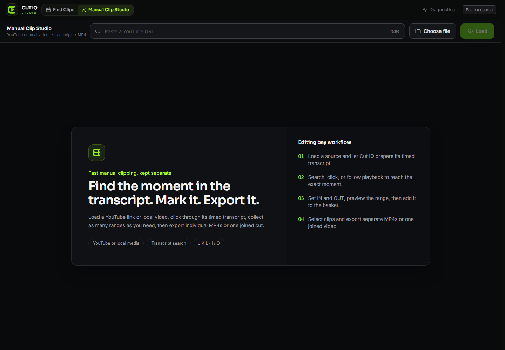

<div align="center">
  
  <p><strong>Find the moment. Make the cut.</strong></p>
  <p>A private, local-first Windows studio for discovering, reviewing, cutting, and exporting video clips.</p>

  [](https://github.com/ArtMoreno/Cut-IQ-Studio/releases/latest)
  [](https://github.com/ArtMoreno/Cut-IQ-Studio/actions/workflows/ci.yml)
  [](https://github.com/ArtMoreno/Cut-IQ-Studio/releases/latest)
  [](LICENSE)
</div>



## One studio, three fast workflows

- **Find Clips** turns a player, team, season, and optional script into a reviewable project of grounded clip candidates.
- **Manual Clip Studio** loads a YouTube URL or local video, follows the timed transcript, marks precise IN/OUT ranges, and exports separate or joined MP4s.
- **Clip Packages** review, refine, replace, download, and organize completed project assets without rewriting the source.

Cut IQ keeps project metadata in a local SQLite file and finished media in your Videos folder. The server binds to `127.0.0.1`; it is not exposed to your LAN or the public internet. Google Drive support is optional and off by default.

## Free and Pro

Cutting is free forever. Pro is a one-time purchase that unlocks the batch and
delivery work, with no subscription and no account.

| | Free | Pro - $29.99 once |
| --- | --- | --- |
| Find Clips projects and review | Yes | Yes |
| Manual Clip Studio | Yes | Yes |
| Render a single clip or moment | Yes | Yes |
| Assemble projects and local export | Yes | Yes |
| Batch render a whole project | - | Yes |
| Batch render every moment on a video | - | Yes |
| Clip package export | - | Yes |
| Broadcast soundbites | - | Yes |
| Drive sync | - | Yes |

[Get Pro](https://artjmoreno.gumroad.com/l/cut-iq-studio-pro). Keys are verified
on your machine against a public key compiled into the app. Activating one does
not contact a server, create an account, or send anything about your projects
anywhere. Keys are issued by hand today, so allow a few hours after buying.

## Install on Windows

1. Download **Cut-IQ-Studio-Setup.exe** from the [latest release](https://github.com/ArtMoreno/Cut-IQ-Studio/releases/latest).
2. Run the installer.
3. Open **Cut IQ Studio** from the desktop or Start menu.

The x64 installer includes the app, Node.js, FFmpeg/ffprobe, and yt-dlp. No separate database or media-tool setup is required. The first launch creates a local database file and:

```text
%USERPROFILE%\Videos\Cut IQ Studio\Clips
%LOCALAPPDATA%\Cut IQ Studio\Data
```

This first public build is not yet code-signed, so Windows may show a SmartScreen notice. Verify the download against the release's `SHA256SUMS.txt` before installing.

Local transcription is optional and is not bundled because speech models add several gigabytes. Timestamped SRT/VTT transcripts can always be imported directly.

## Privacy and safety

- Localhost-only HTTP listener; the database is a local file with no listener at all.
- No analytics, telemetry, advertising, or account requirement.
- No credentials or personal project data in this repository.
- Google Drive and rclone are opt-in environment integrations.
- Project deletion is constrained to Cut IQ-managed folders.
- Source YouTube videos are never deleted by project cleanup.

## Development

Requirements: Node.js 22+. The database is a local SQLite file created on first run.

```powershell
git clone https://github.com/ArtMoreno/Cut-IQ-Studio.git
cd Cut-IQ-Studio
npm ci
Copy-Item .env.example .env
npm run db:push
npm run dev
```

The development server opens at `http://127.0.0.1:3000`. The database file is created automatically; override its location with `CUTIQ_DATABASE_FILE`.

### Quality gates

```powershell
npm test
npm run check
npm run lint
npm run build
```

### Build the Windows installer

On Windows, install [Inno Setup 7](https://jrsoftware.org/isdl.php), then run:

```powershell
.\installer\build-installer.ps1
```

The build downloads pinned upstream runtimes, verifies their SHA-256 hashes, compiles the production app, and writes the installer to `installer/output/`.

## Architecture

| Layer | Technology |
|---|---|
| Desktop UI | React 19, TypeScript, Vite, Tailwind CSS |
| Local API | Hono, tRPC, TanStack Query, zod |
| Project data | Drizzle ORM, SQLite |
| Media pipeline | yt-dlp, FFmpeg, ffprobe |
| Packaging | Inno Setup, GitHub Actions |

```text
src/          React desktop and mobile companion interfaces
server/       Local API, job workers, clip and export engines
db/           Drizzle schema and migrations
public/       Brand assets, fonts, manifest, icons
installer/    Reproducible Windows packaging and launcher
site/         GitHub Pages product site
```

## Responsible use

Cut IQ is a media workflow tool. You are responsible for obtaining permission to download, edit, and publish source material and for following the terms of the services you use.

## License

[MIT](LICENSE) © 2026 Art Moreno. Bundled runtime components retain their own licenses; see [THIRD_PARTY_NOTICES.md](THIRD_PARTY_NOTICES.md).
